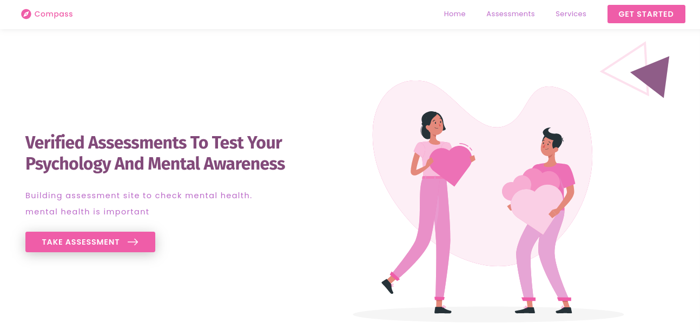

# Compass App

<div>
    <button style='border: none;
        border-radius: 2px;
        font-weight: bold;
        padding: 4px;
        margin-right: 4px; background: #f06529;
        color: #333333;'>HTML</button>
    <button style='border: none;
        border-radius: 2px;
        font-weight: bold;
        padding: 4px;
        margin-right: 4px; background: #2965f1;
        color: #efefef;'>CSS</button>
    <button style="border: none;
        border-radius: 2px;
        font-weight: bold;
        padding: 4px;
        margin-right: 4px; background: #f0db4f;
        color: #333333;">JAVASCRIPT</button>
    <button style='border: none;
        border-radius: 2px;
        font-weight: bold;
        padding: 4px;
        margin-right: 4px; background: green; color: #cecece'>CHINGU</button>
     <button style='border: none;
        border-radius: 2px;
        font-weight: bold;
        padding: 4px;
        margin-right: 4px; background: #333333;
        color: #cecece;'>2021</button>
</div>
<br>

_This is an app created for the purpose of creating awareness about mental health._

## Content

- [Overview](#overview)
  - [Deployment](#deployment)
  - [Screenshot](#screenshot)
- [How to Contribute](#how-to-contribute)
  - [First Time](#first-time)
  - [Returning](#returning)
- [Collaborators](#collaborators)
  - [Product Owner](#product-owner)
- [Credit](#credit)

## Overview

### Deployment

[Compass App](http://mental-compass.netlify.app/) is hosted on [Netlify](http://netlify.app/).

### Screenshot



## How to Contribute

### First time

- Fork the project repository
- <p>Clone your forked repo locally on your computer's terminal</p>
    
   ```
   git clone [cloned-repo.git]
    ```
- Set upstream repository

  ```
  git remote add upstream https://github.com/chingu-voyages/v35-toucans-team-03
  ```

  > Proceed to <a href='#returning'>returning</a> to continue

### Returning

To begin contributing to this project,

- Create a branch of feature you will be working on :

  ```
  git checkout -b [feature-branch]
  ```

- Update your name on the [contributors](#contributors) list on the project's README file

- Write your code

- Add your code to Git locally and commit changes to your remote repository :

  ```
  git add .

  git commit -m "commit-message-here"
  ```

- Sync your code before pushing

  ```
  git pull upstream dev
  ```

- Push your feature branch to your forked repo

  ```
  git push -u origin "feature-branch-name"
  ```

- Open pull request (PR) on GitHub to merge your feature branch into your dev branch

- Submit a new PR to merge your updated dev branch into the upstream dev branch on GitHub

  > please resolve conflicts that arise before making a PR

- You have successfully contributed.

## Contributors

Compass App was built by a team of 5.

#### **Product Owner**

1. <a href="https://github.com/lotthiethief">Cathy K.</a> ()

#### **Developers**

2. <a href="#">Ayman</a>
3. <a href="https://github.com/beblicarl">Carl Bebi</a>
4. <a href="https://github.com/Marrockx">Mariam Adekola</a>
5. <a href="#">Opeoluwa</a>

#### **Designers**

1.  <a href="#">Opeoluwa</a>
2.  <a href="https://github.com/Marrockx">Mariam Adekola</a>

## Credit

This project is facilitated by [chingu.io](https://chingu.io)

<!-- If you are unsure of what should go into the `readme` let this article,
written by an experienced Chingu, be your starting point -
[Keys to a well written README](https://tinyurl.com/yk3wubft). -->
